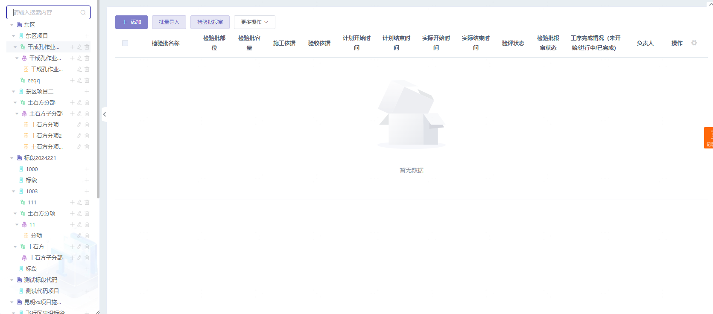

实现效果：可以实现搜索，如果你搜索的是子树，父级也会一起展示；可以实现添加，修改，删除树节点。

注意：这里面点击添加 编辑用的弹框是个组件，自己写一个即可


**通过给公共组件传递自定义事件nodeClick，然后el-tree组件内的内置nodeClick事件调用就触发这个自定义事件，通过这个方式让父组件得到你选中的那个节点数据。**




使用组件

```vue
 <LeftTree
          @nodeClick="nodeClick"
          ref="LeftTree"
          :isShowBtn="true"
        ></LeftTree>

<script>
import {
  qualityGetTree,
  deleteQualityNode,
} from "@/api/construct/qualityVerify/BatchPlan.js";
import AddEditNode from "./addEditNode.vue";

export default {
  methods: {
        nodeClick(node) {
      if (node.level == 5) {
        this.page.pageNo = 1;
        this.currentNode = node;
        this.getTableList();
      }
    },
  }
};
</script>
```

组件内

```vue

<template>
  <div class="treeContainer" v-loading="loading">
    <el-input
      placeholder="请输入搜索内容"
      suffix-icon="el-icon-search"
      v-model="filterText"
      size="small"
    ></el-input>
    <div class="tree">
      <el-tree
        class="filter-tree"
        :data="TempleteTree"
        :expand-on-click-node="false"
        @node-click="nodeClick"
        :props="defaultProps"
        default-expand-all
        node-key="uniqueId"
        :filter-node-method="filterNode"
        ref="tree"
        :indent="4"
      >
        <span class="custom-tree-node keywords_em" slot-scope="{ data, node }">
          <el-image
            class="imageClass"
            :src="require('@/assets/icons/treeIcon/level1.png')"
            :fit="'fill'"
            v-if="node.level == 1"
          ></el-image>
          <el-image
            class="imageClass"
            :src="require('@/assets/icons/treeIcon/level2.png')"
            :fit="'fill'"
            v-if="node.level == 2"
          ></el-image>
          <el-image
            class="imageClass"
            :src="require('@/assets/icons/treeIcon/level3.png')"
            :fit="'fill'"
            v-if="node.level == 3"
          ></el-image>
          <el-image
            class="imageClass"
            :src="require('@/assets/icons/treeIcon/level4.png')"
            :fit="'fill'"
            v-if="node.level == 4"
          ></el-image>
          <el-image
            class="imageClass"
            :src="require('@/assets/icons/treeIcon/level5.png')"
            :fit="'fill'"
            v-if="node.level == 5"
          ></el-image>
          <div class="treeName" >
            <div :class="isShowBtn?'name':'name2'">{{ data.name }}</div>
            <div class="icon" v-show="data.level !== 1" style=" opacity: 0.3;" v-if="isShowBtn">
              <i
                class="el-icon-plus icons"
                @click="open(data)"
                v-show="data.level !== 5"
                v-btnshow="'WBS:add'"
              ></i
              ><i class="el-icon-edit icons" @click="edit(data)" v-show="data.level !== 2" v-btnshow="'WBS:edit'"></i>
              <i class="el-icon-delete icons" @click="deleteOne(data)" v-show="data.level !== 2" v-btnshow="'WBS:delete'"></i>
            </div>
          </div>
        </span>
      </el-tree>
    </div>
    <AddEditNode ref="AddEditNode" :getTableList="getTree"></AddEditNode>
  </div>
</template>

<script>
import {
  qualityGetTree,
  deleteQualityNode,
} from "@/api/construct/qualityVerify/BatchPlan.js";
import AddEditNode from "./addEditNode.vue";

export default {
  components: {
    AddEditNode,
  },
  data() {
    return {
      TempleteTree: [],
      defaultProps: {
        children: "children",
        label: "name",
      },
      filterText: "",
      loading: false,
    };
  },
  props:{
      //是否展示添加编辑删除功能的按钮
    isShowBtn:{
      type:Boolean,
      default:false
    }
  },
  watch: {
    filterText(val) {
      this.$refs.tree.filter(val);
    },
  },
  mounted() {
    this.getTree();
  },
  methods: {
    async getTree() {
      try {
        this.loading = true;
        let res = await qualityGetTree({ data: {} });
        if (res.code == "1") {
          this.TempleteTree = res.result || [];
        }
        this.loading = false;
      } catch (error) {
        this.loading = false;
        console.log(error);
      }
    },
    filterNode(value, data) {
      if (!value) return true;
      return data.name.indexOf(value) !== -1;
    },
    nodeClick(node) {
      this.$emit("nodeClick", node);
    },
    open(data) {
      this.$refs.AddEditNode.open(data);
    },
    edit(data) {
      this.$refs.AddEditNode.edit(data);
    },
    deleteOne(row) {
      this.$confirm("此操作将删除该节点, 是否继续?", "提示", {
        confirmButtonText: "确定",
        cancelButtonText: "取消",
        type: "warning",
      })
        .then(() => {
          this.todeleteQualityNode(row);
        })
        .catch(() => {});
    },
    async todeleteQualityNode(row) {
      try {
        let res = await deleteQualityNode({
          data: { id: row.id, level: row.level },
        });
        if (res.code == "1") {
          this.$message({
            type: "success",
            message: "删除成功!",
          });
          this.getTree();
        }
      } catch (error) {
        console.log(error);
      }
    },
  },
};
</script>

<style lang="less" scoped>
.imageClass {
  width: 14px;
  height: 14px;
  margin-right: 5px;
 
}
.keywords_em {
  font-size: 13px;
  display: flex;
  align-items: center;
  justify-content: space-between;
  width: 100%;
  .treeName {
    display: flex;
    align-items: center;
    // justify-content: space-between;
    width: 100%;
    position: relative;
    .name {
      width: calc(100% - 60px);
      white-space: nowrap;
      overflow: hidden;
      text-overflow: ellipsis;
    }
    .name2 {
      width: 100%;
      white-space: nowrap;
      overflow: hidden;
      text-overflow: ellipsis;
    }
    .icon {
      flex-shrink: 0;
      position: absolute;
      right: 0;
      .icons {
        z-index: 999;
        margin: 0 2px;
      }
    }
  }
}
</style>

```

