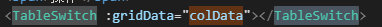
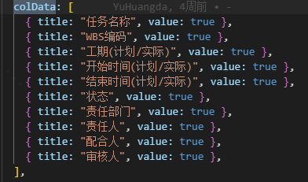
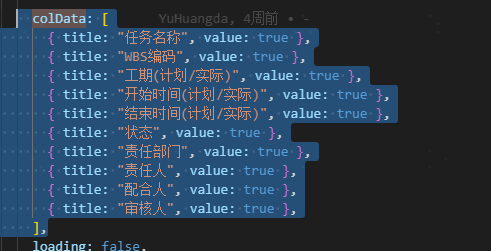

```js
//模板导入的el-upload的http-request写法
async httpUpload(params) {
      this.confirmUploadLoading = true;
      let file = params.file;
      let form = new FormData();
      form.append("file", file);
      form.append("vocatType", this.vocatType);
      form.append(
        "mapStr",
        JSON.stringify({ createUserId: localStorage.getItem("UserId") })
      );
      try {
        let res = await request({
          // url: "/bom/file/upload/excel",
          url: "pms/business/file/upload/excel",
          method: "post",
          headers: { "content-type": "multipart/form-data;" },
          data: form,
        });
        if (res.code == "1") {
          this.$message({
            type: "success",
            message: "Excel导入成功",
          });
          this.dialogVisible2 = false;
          this.confirmUploadLoading = false;
          this.getProgressList();
        } else {
          this.confirmUploadLoading = false;
          message({
            type: "warning",
            message: res,
            duration: 5 * 1000,
          });
          this.fileList = [];
          this.$refs.upload.clearFiles();

          return Promise.reject();
        }
      } catch (error) {
        this.confirmUploadLoading = false;
        this.$refs.upload.clearFiles();
        message({
          type: "warning",
          message: error.message.slice(0, 499),
          duration: 5 * 1000,
        });
        this.fileList = [];

        return Promise.reject();
      }
    },
```

点击任务模板 下载模板

```js
 async downloadMoban() {
      try {
        let res = await this.API.downloadExcel("里程碑计划导入模板.xlsx");
        let blob = new Blob([res], {
          type: "application/vnd.openxmlformats-officedocument.spreadsheetml.sheet;charset=utf-8",
        });
        var link = document.createElement("a");
        link.href = window.URL.createObjectURL(blob);
        link.download = "里程碑计划导入模板.xlsx";
        link.click();
        //释放内存       window.URL.revokeObjectURL(link.href);
      } catch (error) {
        console.log(error);
      }
    },
```

齿轮





```vue
<template>
  <el-popover placement="right" trigger="click" style="margin: 0 10px">
    <div class="switchDiv" v-for="(item, index) in gridData" :key="index">
      <span class="switchSpan">{{ item.title }}</span>
      <el-switch
        v-model="item.value"
        active-color="#13ce66"
        inactive-color="#ccc"
      >
      </el-switch>
    </div>
    <i slot="reference" class="el-icon-s-tools ee" style="font-size: 15px"></i>
  </el-popover>
</template>

<script>
export default {
  props: ["gridData"],
};
</script>

<style scoped>
.switchSpan {
  margin-right: 30px;
}
.switchDiv {
  margin-bottom: 10px;
  display: flex;
  justify-content: space-between;
}
.ee {
  color: #d2d4d6;
  font-weight: 0;
}
</style>
```

```vue
<template>
  <div>
    <el-row type="flex" class="ListUpwardSideModel">
      <el-col class="textAlignLeft">
        <el-button
          size="small"
          class="filter-item"
          type="primary"
          @click="handleAdd"
          icon="el-icon-plus"
          :disabled="currentNode.level !== 5"
        >
          添加
        </el-button>
        <el-button
          size="small"
          plain
          class="filter-item"
          type="primary"
          @click="openUploadDialog"
        >
          批量导入
        </el-button>
        <el-button
          size="small"
          plain
          class="filter-item"
          type="primary"
          @click="batchApproval(1)"
          :loading="loading"
        >
          检验批报审
        </el-button>
        <el-dropdown style="margin-left: 10px" placement="bottom">
          <el-button plain size="small">
            更多操作<i class="el-icon-arrow-down el-icon--right"></i>
          </el-button>
          <el-dropdown-menu slot="dropdown">
            <el-dropdown-item @click.native="multiDelete"
              >批量删除</el-dropdown-item
            >
            <el-dropdown-item @click.native="multiEdit"
              >批量编辑</el-dropdown-item
            >
            <!-- v-btnshow="'pre:BatchPlan:edit'" -->
            <el-dropdown-item @click.native="batchApproval(2)"
              >检验批调整报审</el-dropdown-item
            >
            <el-dropdown-item>模型绑定</el-dropdown-item>
            <el-dropdown-item @click.native="openWBSDialog"
              >WBS划分</el-dropdown-item
            >
            <el-dropdown-item>分项报验</el-dropdown-item>
          </el-dropdown-menu>
        </el-dropdown>
      </el-col>
      <el-col class="textAlignRight"></el-col>
    </el-row>

    <el-table
      :data="tableList"
      :header-cell-style="{ 'text-align': 'center' }"
      :cell-style="{ 'text-align': 'center' }"
      id="out-table"
      @selection-change="selectionChange"
    >
      <template slot="empty">
        <el-empty description="暂无数据"></el-empty>
      </template>
      <el-table-column
        type="selection"
        fixed="left"
        width="55"
      ></el-table-column>
      <el-table-column
        label="检验批名称"
        show-overflow-tooltip
        min-width="100"
        prop="checkoutBatchName"
      ></el-table-column>

      <el-table-column
        label="检验批部位"
        show-overflow-tooltip
        min-width="100"
        prop="checkoutBatchPart"
      ></el-table-column>

      <el-table-column
        label="检验批容量"
        show-overflow-tooltip
        min-width="100"
        prop="qualityCheckoutCapacity"
      ></el-table-column>

      <el-table-column
        label="施工依据"
        show-overflow-tooltip
        prop="constructionFileName"
      ></el-table-column>

      <el-table-column
        label="验收依据"
        show-overflow-tooltip
        prop="acceptFileName"
      ></el-table-column>

      <el-table-column
        label="计划开始时间"
        show-overflow-tooltip
        min-width="110"
        prop="startTime"
      ></el-table-column>

      <el-table-column
        label="计划结束时间"
        show-overflow-tooltip
        min-width="110"
        prop="endTime"
      ></el-table-column>

      <el-table-column
        label="负责人"
        show-overflow-tooltip
        prop="chargePersonName"
      ></el-table-column>
      <el-table-column label="绑定状态" show-overflow-tooltip prop="modelBind">
        <template v-slot="{ row }">
          {{ row.modelBind === 1 ? "已绑定" : "未绑定" }}
        </template>
      </el-table-column>

      <el-table-column label="操作" width="100">
        <template v-slot="{ row }">
          <el-button
            @click="handleEdit(row)"
            class="ListEditBtn"
            type="text"
            :disabled="![0].includes(row.approveStatus)"
            v-btnshow="'pre:BatchPlan:edit'"
          >
            编辑
          </el-button>
        </template>
      </el-table-column>
    </el-table>

    <el-dialog
      :title="dialogTitle"
      :visible.sync="showSubmitTable"
      top="10vh"
      width="70%"
      :modal="false"
      :close-on-click-modal="false"
      :before-close="handleClose"
      v-dialogDrag
    >
      <div style="height: 60vh" class="scollStyle">
        <el-table
          :data="tableList2"
          :header-cell-style="{ 'text-align': 'center' }"
          :cell-style="{ 'text-align': 'center' }"
          id="out-table"
          height="100%"
          v-loading="DialogLoading"
          @selection-change="selectionChange2"
        >
          <template slot="empty">
            <el-empty description="暂无数据"></el-empty>
          </template>
          <el-table-column
            type="selection"
            fixed="left"
            width="55"
          ></el-table-column>
          <el-table-column
            label="检验批名称"
            show-overflow-tooltip
            min-width="100"
            prop="checkoutBatchName"
          ></el-table-column>

          <el-table-column
            label="检验批部位"
            show-overflow-tooltip
            min-width="100"
            prop="checkoutBatchPart"
          ></el-table-column>

          <el-table-column
            label="检验批容量"
            show-overflow-tooltip
            min-width="100"
            prop="qualityCheckoutCapacity"
          ></el-table-column>

          <el-table-column
            label="施工依据"
            show-overflow-tooltip
            prop="constructionFileName"
          ></el-table-column>

          <el-table-column
            label="验收依据"
            show-overflow-tooltip
            prop="acceptFileName"
          ></el-table-column>

          <el-table-column
            label="计划开始时间"
            show-overflow-tooltip
            min-width="110"
            prop="startTime"
          ></el-table-column>

          <el-table-column
            label="计划结束时间"
            show-overflow-tooltip
            min-width="110"
            prop="endTime"
          ></el-table-column>

          <el-table-column
            label="负责人"
            show-overflow-tooltip
            prop="chargePersonName"
          ></el-table-column>
          <el-table-column
            label="绑定状态"
            show-overflow-tooltip
            prop="modelBind"
          >
            <template v-slot="{ row }">
              {{ row.modelBind === 1 ? "已绑定" : "未绑定" }}
            </template>
          </el-table-column>
        </el-table>
      </div>
      <el-pagination
        @size-change="DialogPageSizeChange"
        :current-page="1"
        layout="sizes"
        :page-sizes="[10, 200, 500, 1000, 2000]"
        :page-size="DialogPageSize"
        align="right"
        background
      ></el-pagination>

      <span slot="footer" class="dialog-footer">
        <el-button @click="handleClose">取消</el-button>
        <el-button
          type="primary"
          :loading="confirmLoading"
          @click="confirmBatch"
        >
          确认
        </el-button>
      </span>
    </el-dialog>

    <!-- 导入弹框 -->
    <el-dialog
      title="检验批导入"
      :close-on-click-modal="false"
      :visible.sync="upDateDialogVisible"
      width="50%"
      :before-close="handleClose"
    >
      <div class="dialogContainer scollStyle">
        <div class="stepContainer S2">
          <el-upload
            accept=".xls,.xlsx"
            ref="upload"
            drag
            :on-change="onChange"
            :before-upload="beforeUpload"
            :http-request="httpUpload"
            :auto-upload="false"
            :multiple="false"
            class="upload-demo"
            action=""
            :limit="1"
          >
            <div class="el-uploadContainer">
              <el-image
                style="width: 82px; height: 82px"
                :src="require('@/assets/icons/progress/uploadIcon.png')"
                :fit="'contain'"
              ></el-image>
              <div class="uploadtext">
                <div class="el-upload__text">点击或将文件拖拽到这里上传</div>
                <div class="el-upload__tip">只能上传Excel文件，且不超过50M</div>
              </div>
            </div>
          </el-upload>
        </div>

        <div class="explain">
          <div class="tit">操作说明</div>
          <div class="imgAndText">
            
            <div>
              第一步，请先下载
              <span
                style="color: #ff6809; cursor: pointer"
                @click="downloadMoban"
              >
                任务模板
              </span>
            </div>
          </div>

          <div class="imgAndText">
            
            <div>
              第二步，下载后，填写内容，注意，要填写的内容在下边的说明中有详细的说明，请一定要确认你的Excel文档格式是模板中的格式，而没有被修改改掉
            </div>
          </div>

          <div class="imgAndText">
            
            <div>第三步，选择填写好的Excel文档，点击导入进行批量导入</div>
          </div>

          <div class="imgAndText">
            
            <div>
              第四步，如果以上步骤和Excel文档正确的话，数据会被正确的导入，导入成功会有提示，如果有问题，则会导入失败
            </div>
          </div>
        </div>
      </div>

      <span slot="footer" class="dialog-footer">
        <el-button @click="upDateDialogVisible = false">取 消</el-button>
        <el-button
          :loading="confirmUploadLoading"
          type="primary"
          @click="confirmUpload"
        >
          确 定
        </el-button>
      </span>
    </el-dialog>
    <WBSDialog ref="WBSDialog"></WBSDialog>

    <!-- 检验批编辑弹框表单 -->
    <DialogForm
      ref="DialogForm"
      @closeDialog="closeDialog"
      :currentNode="currentNode"
    ></DialogForm>
    <!-- 检验批编辑弹框表单 -->
    <BatchEditForm
      @closeDialog="closeDialog"
      ref="BatchEditForm"
    ></BatchEditForm>
  </div>
</template>
<script>
import WBSDialog from "./WBSDialog.vue";
import DialogForm from "./DialogForm.vue";
import BatchEditForm from "./BatchEditForm.vue";
import {
  qualityExport,
  batchDelete,
  checkoutBatchList,
  uploadExcel,
} from "@/api/construct/qualityVerify/BatchPlan.js";

export default {
  components: {
    WBSDialog,
    DialogForm,
    BatchEditForm,
  },
  data() {
    return {
      multipleSelection: [],
      multipleSelection2: [],
      tableList2: [],
      showSubmitTable: false,
      confirmLoading: false,
      loading: false,
      dialogTitle: "请选择可报审的检验批",
      upDateDialogVisible: false,
      fileList: [],
      confirmUploadLoading: false,
      DialogPageSize: 10,
      DialogLoading: false,
    };
  },
  props: {
    page: {
      type: Object,
    },
    currentNode: {
      type: Object,
      default: () => {
        return {};
      },
    },
    tableList: {
      type: Array,
      default: () => {
        return [];
      },
    },
  },
  methods: {
    handleAdd() {
      this.$refs.DialogForm.OpenOrCloseAddDialog({
        disabled: true,
        row: {},
        title: "新增检验批",
      });
    },
    openWBSDialog() {
      this.$refs.WBSDialog.open();
    },
    multiDelete() {
      if (!(this.multipleSelection || []).length) {
        this.$message({
          message: "请选择要删除的检验批",
          type: "warning",
        });
        return;
      }
      this.$confirm("此操作将永久删除这些检验批, 是否继续?", "提示", {
        confirmButtonText: "确定",
        cancelButtonText: "取消",
        type: "warning",
      })
        .then(async () => {
          try {
            let res = await batchDelete({
              data: {
                checkoutBatchIds: this.multipleSelection.map(
                  (item) => item.checkoutBatchId
                ),
              },
            });
            if (res.code == "1") {
              this.$emit("refreshTable");
              this.$message({
                type: "success",
                message: "删除成功!",
              });
            }
          } catch (error) {}
        })
        .catch(() => {});
    },
    multiEdit() {
      if (!(this.multipleSelection || []).length) {
        this.$message({
          message: "请选择要编辑的检验批",
          type: "warning",
        });
        return;
      }
      this.$refs.BatchEditForm.OpenOrCloseBatchEdit({
        status: true,
        multipleSelection: this.multipleSelection,
        title: "批量编辑检验批",
      });
    },
    selectionChange(val) {
      this.multipleSelection = val;
    },
    selectionChange2(val) {
      this.multipleSelection2 = val;
    },
    //关闭并刷新列表
    closeDialog() {
      this.page.pageNo = 1;
      console.log("关闭刷新");
      this.getTableList();
    },
    handleEdit(row) {
      this.$refs.DialogForm.OpenOrCloseAddDialog({
        status: true,
        row: row,
        title: "编辑检验批",
      });
    },
    async DialogPageSizeChange(size) {
      try {
        this.DialogPageSize = size;
        this.DialogLoading = true;
        let res = await checkoutBatchList({
          data: {
            subitemId: this.currentNode.orgId,
            approveStatus: this.type == 1 ? 0 : 2,
          },
          page: {
            pageNo: 1,
            pageSize: this.DialogPageSize,
          },
        });
        if (res.code == "1") {
          this.tableList2 = res.result.list || [];
        }
        this.DialogLoading = false;
      } catch (error) {
        this.DialogLoading = false;
      }
    },
    async batchApproval(type) {
      if (!this.currentNode.orgId) {
        this.$message({
          message: "请先选择[分项工程]",
          type: "warning",
        });
        return;
      }
      try {
        this.loading = true;
        this.type = type;
        let res = await checkoutBatchList({
          data: {
            subitemId: this.currentNode.orgId,
            approveStatus: this.type == 1 ? 0 : 2,
            workStatus: this.type == 2 ? 0 : null,
          },
          page: {
            pageNo: 1,
            pageSize: this.DialogPageSize,
          },
        });
        if (res.code == "1") {
          this.tableList2 = res.result.list || [];
          this.dialogTitle =
            this.type == 1
              ? "请选择可报审的检验批"
              : "请选择可变更报审的检验批";
          if (this.tableList2.length) {
            this.showSubmitTable = true;
          } else {
            this.$message({
              type: "warning",
              message:
                this.type == 1
                  ? "当前分项下没有可以报审的检验批 或 当前检验批都已报审/报审中"
                  : "当前分项下没有可以变更报审的检验批 或 当前检验批都已报审/报审中",
            });
          }
        }
        this.loading = false;
      } catch (error) {
        this.loading = false;
        console.log(error);
      }
    },
    confirmBatch() {
      if (!(this.multipleSelection2 || []).length) {
        this.$message({
          message: "请先选择要报审的检验批",
          type: "warning",
        });
        return;
      }
      this.$emit("OpenOrCloseBatchApproval", {
        multipleSelection: this.multipleSelection2,
        type: this.type,
      });
      this.showSubmitTable = false;
    },
    openUploadDialog() {
      this.upDateDialogVisible = true;
    },
    handleClose() {
      this.upDateDialogVisible = false;
      this.showSubmitTable = false;
      this.DialogPageSize = 10;
    },
    async downloadMoban() {
      try {
        let res = await qualityExport({ data: {} });
      } catch (error) {
        console.log(error);
      }
    },
    onChange(file, fileList) {
      this.fileList = fileList;
    },
    beforeUpload(file) {
      const isLt2M = file.size / 1024 / 1024 < 50; //这里做文件大小限制
      if (!isLt2M) {
        this.$message({
          message: "上传文件大小不能超过 50MB!",
          type: "warning",
        });
      }
      return isLt2M;
    },
    async httpUpload(params) {
      this.confirmUploadLoading = true;
      let file = params.file;
      let form = new FormData();
      let currentUserId = localStorage.getItem("UserId");
      form.append("file", file);
      form.append("vocatType", "QUALITY_PLAN_IMPORT");
      form.append(
        "mapStr",
        JSON.stringify({
          userId: currentUserId,
          subitemId: this.currentNode.orgId,
        })
      );
      try {
        let res = await uploadExcel(form);
        if (res.code == "1") {
          this.$message({
            type: "success",
            message: "Excel导入成功",
          });
          if (this.currentNode.orgId) {
            this.page.pageNo = 1;
            this.page.pageSize = 10;
            this.getTableList();
          }
          this.fileList = [];
          this.$refs.upload.clearFiles();
          this.upDateDialogVisible = false;
          this.confirmUploadLoading = false;
        } else {
          this.fileList = [];
          this.$refs.upload.clearFiles();
          this.confirmUploadLoading = false;
          return Promise.reject();
        }
      } catch (error) {
        this.fileList = [];
        this.$refs.upload.clearFiles();
        this.confirmUploadLoading = false;
        return Promise.reject();
      }
    },
    confirmUpload() {
      if (!this.fileList.length) {
        this.$message({
          type: "warning",
          message: "请先选择文件",
        });
      }
      this.$refs.upload.submit();
    },
  },
};
</script>
<style scoped lang="less">
.formdiv {
  display: flex;
  align-items: center;
  span {
    flex-shrink: 0;
    margin: 0 15px;
    color: #606266;
    font-size: 14px;
  }
}
.dialogContainer {
  height: auto;
  width: 100%;
  overflow: overlay;

  .stepContainer {
    width: 100%;
    height: auto;
    border-radius: 4px 4px 4px 4px;
    display: flex;
    align-items: center;
    justify-content: center;
    padding: 25px;

    .btn {
      border: none;
      padding-left: 31px;
      padding-right: 31px;
    }

    span {
      font-size: 13px;
      font-family: PingFang SC-Regular, PingFang SC;
      font-weight: 400;
      color: #555e6b;
    }
  }

  .S1 {
    margin-top: 15px;
  }

  .S2 {
    // margin-bottom: 30px;
  }

  .explain {
    width: 100%;
    height: auto;

    .tit {
      font-size: 13px;
      font-family: PingFang SC-Regular, PingFang SC;
      font-weight: 600;
      color: #2f3138;
    }

    .imgAndText {
      display: flex;
      align-items: center;
      justify-content: space-between;
      height: 45px;

      img {
        width: 27px;
        height: 20px;
        margin-left: 11px;
        margin-right: 26px;
      }

      div {
        flex-grow: 1;
        font-size: 13px;
        font-family: PingFang SC-Regular, PingFang SC;
        font-weight: 400;
        color: #555e6b;
        line-height: 18px;
      }
    }
  }
}
</style>

```

操作项

```js
 <el-table-column
              label="操作"
              show-overflow-tooltip
              align="center"
              fixed="right"
              v-if="releaseState"
            >
              <template slot="header">
                <div
                  style="
                    display: flex;
                    align-item: center;
                    justify-content: space-around;
                  "
                >
                  <span>操作</span>
                  <TableSwitch :gridData="colData"></TableSwitch>
                </div>
              </template>
              <template v-slot="{ row }">
                <el-dropdown
                  :placement="'bottom'"
                  @click.native.stop="() => {}"
                >
                  <span class="el-dropdown-link">
                    <!-- 下拉菜单<i class="el-icon-arrow-down el-icon--right"></i> -->
                    <i class="el-icon-more" style="font-size: 20px"></i>
                  </span>
                  <el-dropdown-menu slot="dropdown">
                    <el-dropdown-item @click.native.stop="flowBind(row)"
                      >流程绑定</el-dropdown-item
                    >
                    <el-dropdown-item
                      @click.native.stop="add(row.taskId, '')"
                      v-show="row.level < 7"
                      :disabled="activeBtn == 2"
                      >新增</el-dropdown-item
                    >
                    <el-dropdown-item
                      @click.native.stop="openEdit(row)"
                      :disabled="
                        row.createdBy != currentUserId || row.status == '5'
                      "
                      >编辑</el-dropdown-item
                    >
                    <el-dropdown-item
                      @click.native.stop="openFeedBackDialog(row)"
                      :disabled="
                        !(row.personList || []).find(
                          (item) => item.userId == currentUserId
                        ) && row.createdBy != currentUserId
                      "
                      >反馈</el-dropdown-item
                    >
                    <el-dropdown-item
                      @click.native.stop="deleteProgressPlan(row)"
                      >删除</el-dropdown-item
                    >
                  </el-dropdown-menu>
                </el-dropdown>
              </template>
            </el-table-column>
```

 colData: [

​    { title: "任务名称", value: true },

​    { title: "WBS编码", value: true },

​    { title: "工期(计划/实际)", value: true },

​    { title: "开始时间(计划/实际)", value: true },

​    { title: "结束时间(计划/实际)", value: true },

​    { title: "状态", value: true },

​    { title: "责任部门", value: true },

​    { title: "责任人", value: true },

​    { title: "配合人", value: true },

​    { title: "审核人", value: true },

   ],



users/organizationConfig/components/addPackage
